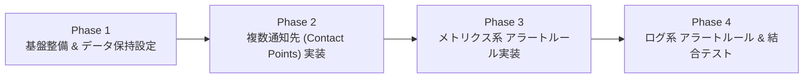

# PLG Monitoring アラート・通知機能 実装計画書

本ドキュメントは、`plg-monitoring` ロールに Grafana Unified Alerting による自動監視および複数チャネル通知機能（Discord / Gmail / Slack等）を追加するための段階的実装計画です。

---

## 1. 全体ロードマップ



---

## 2. 各フェーズの詳細作業内容

### 【Phase 1】基盤整備 & データ保持期間（Retention）の管理
- **Prometheus データ保持設定**: `docker-compose.yml.j2` に `--storage.tsdb.retention.time={{ plg_monitoring_prometheus_retention }}` (デフォルト: `30d`) を追加。
- **Loki データ保持設定**: `loki-config.yml` に保持期間設定（`retention_period: 30d`）を反映。
- **Grafana SMTP 送信基盤（Gmail連携）の有効化**:
  - `defaults/main.yml` に SMTP 関連変数（`plg_monitoring_smtp_enabled`, `plg_monitoring_smtp_host`, `plg_monitoring_smtp_user` 等）を追加。
  - `templates/docker-compose.yml.j2` に `GF_SMTP_*` 環境変数を追加。

### 【Phase 2】複数通知先（Contact Points / Notification Policies）の実装
- **変数定義の拡張 (`defaults/main.yml`)**:
  - `plg_monitoring_alerts_enabled: false`
  - `plg_monitoring_alert_receivers: []` （リスト形式で Discord / Email / Slack 等を複数定義可能にする）
- **Contact Points テンプレート作成 (`templates/alerting_contact_points.yml.j2`)**:
  - 各通知先（`discord`, `email`, `slack`, `webhook`）のループ展開。
  - Discord 埋め込みカードメッセージおよびメンション設定。
  - 障害解決時通知（**Resolved Notification**）の有効化。
- **タスク更新 (`tasks/main.yml`)**:
  - `/opt/plg-monitoring/grafana/provisioning/alerting/` ディレクトリの作成とテンプレート展開。

### 【Phase 3】メトリクス系 アラートルール（Alert Rules）の実装
- **アラートルールテンプレート作成 (`templates/alerting_rules_metrics.yml.j2`)**:
  - **ホスト死活監視**: `up{job="node_exporter"} == 0` (2分間継続で Critical 通知)
  - **ディスク空き容量枯渇**: 空き容量 10% 未満 (5分間継続で Critical 通知)
  - **CPU 高負荷**: 使用率 90% 以上 (5分間継続で Warning 通知)
  - **GPU 温度異常**: `nvidia_smi_temperature_gpu >= 85` (2分間継続で Warning/Critical 通知)
  - **GPU VRAM 枯渇**: 使用率 95% 以上が 5分間継続
  - **NFS マウント外れ**: NFS マウントポイントへのアクセス途絶検知
- **クラスタ名の連動**:
  - ルール名・タイトル・UID に `{{ plg_monitoring_cluster_name }}` を埋め込み。

### 【Phase 4】ログ系 アラートルール（Loki）の実装 & 結合テスト
- **Loki ログベースのアラートルール作成 (`templates/alert_rules_logs.yml.j2`)**:
  - **OOM Killer 検知**: ログ内の `Out of memory: Killed process` を検知。
- **実機結合テスト (`asuka-01`)**:
  - Discord / Gmail へのテスト通知着信確認。
  - 模擬障害テスト（Alloy 停止による `Host Down` 発報および再起動による `Resolved` 復旧通知の確認）。
- **ドキュメント更新 & コミット**:
  - `README.md` の更新と Git コミット。

---

## 3. 設定例 (`group_vars/all.yml`)

```yaml
# ---------------------------------------------------------------------
# PLG Monitoring Alerts & Notification Settings
# ---------------------------------------------------------------------
plg_monitoring_alerts_enabled: true

# Gmail 送信設定
plg_monitoring_smtp_enabled: true
plg_monitoring_smtp_user: "your-alert-sender@gmail.com"
plg_monitoring_smtp_password: "abcd efgh ijkl mnop"  # ※Ansible Vault推奨

# 複数通知先の設定
plg_monitoring_alert_receivers:
  - name: "Discord Alert Room"
    type: "discord"
    url: "https://discord.com/api/webhooks/1234567890/xxxxxxxxx"

  - name: "Server Admin Mail"
    type: "email"
    addresses:
      - "admin@lab.example.jp"
      - "user@example.com"
```
